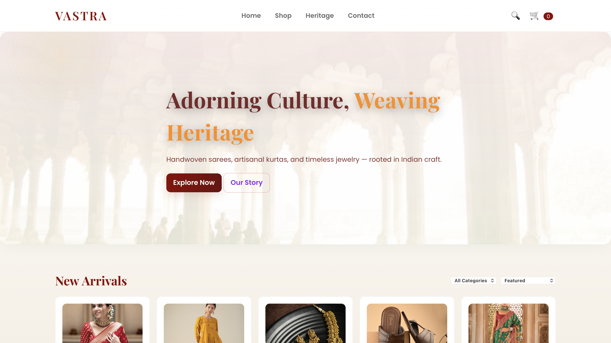
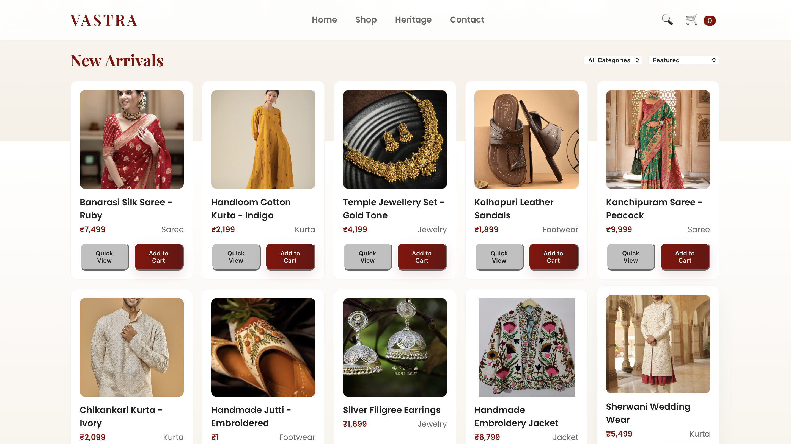
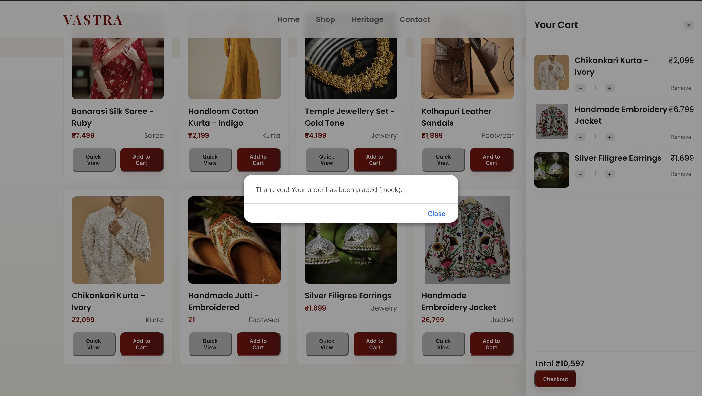

# 🛍️ Vastra - Indian Fashion E-Commerce Website

A responsive Indian fashion e-commerce website inspired by modern Indian fashion brands, built using **HTML**, **CSS**, and **JavaScript**. The project focuses on creating a clean shopping experience with product browsing, cart management, and checkout functionality.

---

## 🌐 Live Demo

👉 https://sameerkumar751.github.io/Vastra-ecommerce/

---

## 📸 Project Preview

### Home Page



### Product Page



### Shopping Cart



---

## ✨ Features

- Responsive user interface
- Modern Indian fashion theme
- Product listing
- Product details page
- Add to Cart functionality
- Dynamic cart price calculation
- Checkout popup
- Clean and simple UI

---

## 🛠️ Tech Stack

- HTML5
- CSS3
- JavaScript

---

## 📂 Project Structure

```text
Vastra-ecommerce/
│
├── index.html
├── style.css
├── script.js
├── screenshots/
└── README.md
```

---

## 🚀 Getting Started

Clone the repository

```bash
git clone https://github.com/SameerKumar751/Vastra-ecommerce.git
```

Open

```text
index.html
```

in your browser.

---

## 🔮 Future Improvements

- User Authentication
- Wishlist
- Product Search
- Payment Gateway
- Backend Integration
- Order History
- Admin Dashboard

---

## 👨‍💻 Author

**Sameer Kumar**

B.Tech Computer Science Engineering

Aspiring Data Engineer | Full Stack (MERN) Developer

---

⭐ If you liked this project, consider giving it a star.
